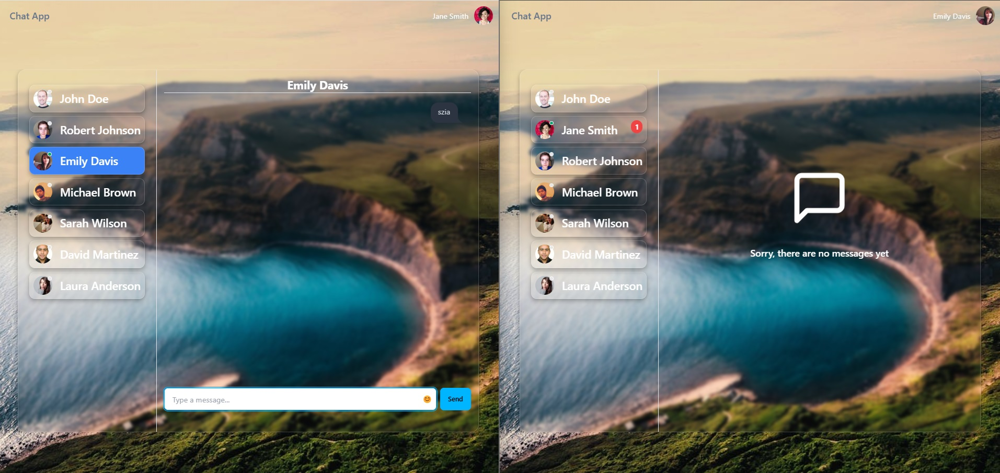
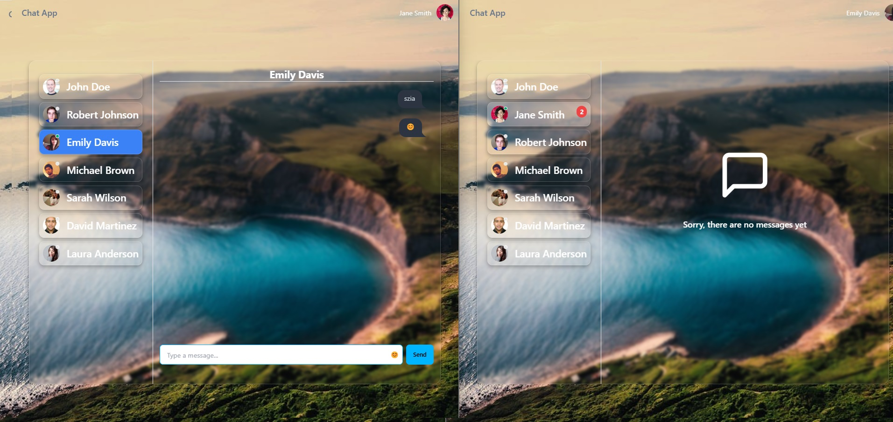
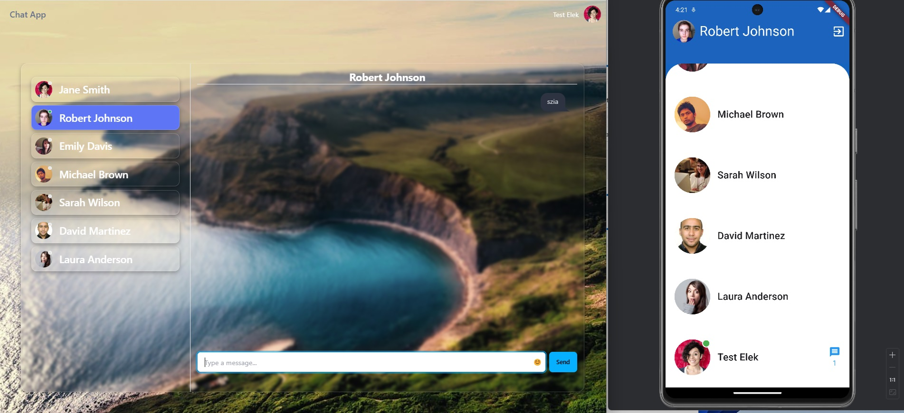
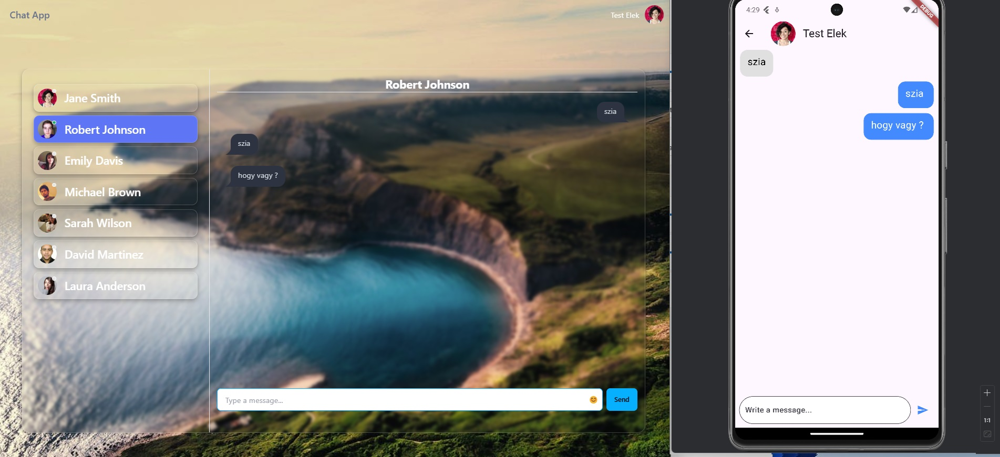

## Inspiration  
This project was inspired by this video: [Real-Time Chat App Tutorial](https://www.youtube.com/watch?v=ntKkVrQqBYY&t=14591s)

# Real-Time Chat App

## Overview
This is a real-time chat application built with modern web technologies. It supports user authentication, real-time messaging, and an intuitive UI for a seamless chat experience.

## Tech Stack

### Database
- MySQL
- Prisma ORM

### Backend
- Node.js
- TypeScript
- Express
- Prisma
- Bcrypt (for password hashing)
- Cookie-Parser
- CORS
- Dotenv
- JSON Web Token (JWT)
- Socket.io

### Frontend
- React
- Tailwind CSS
- Axios
- Emoji-Picker-React
- React-Router-Dom
- Socket.io-Client
- DaisyUI
- React-Toastify

### Flutter
- flutter animate
- flutter custom clippers
- flutter riverpod
- http
- flutter secure storage
- intl
- socket io client
- flutter local notifications
- permission handler

## Features
- User authentication (register, login, JWT/cookie-parser-based authentication)
- Real-time messaging with WebSockets (Socket.io)
- Secure password hashing
- Responsive UI with Tailwind CSS
- Emoji support
- Persistent chat history with MySQL

